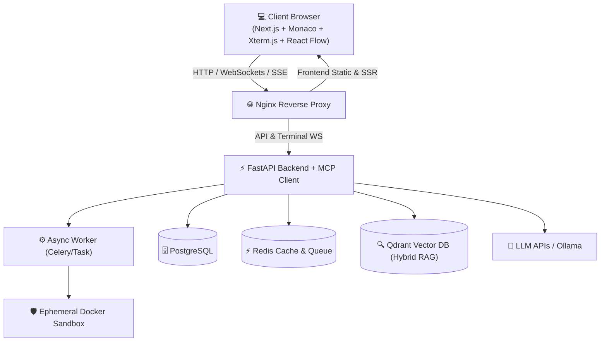

# 🤖 AI Software Engineer - Autonomous Coding Assistant Platform

An enterprise-grade, agentic AI Coding Assistant platform built for modern software development. Featuring multi-agent orchestration, full-workspace AST indexing & semantic vector retrieval (RAG), Monaco-powered code editor, interactive WebSocket web terminal, isolated code execution sandbox, and production-ready cloud deployment infrastructure.

---

## 🌟 Key Features

- **🧠 Agentic AI Core**: Powered by LangGraph and LangChain, supporting flexible multi-agent workflows for autonomous planning, multi-file code editing, refactoring, code review, and automated debugging.
- **⚡ Multiple LLM Support**: Seamlessly switch between local models (Ollama / Mistral) and cloud providers (OpenAI, Anthropic Claude, Google Gemini, OpenRouter).
- **🔎 AST & Vector Semantic Retrieval (RAG)**: Combines tree-sitter AST code parsing with Qdrant / FAISS vector databases to index codebase structures, symbols, and dependencies for precise, context-aware AI context retrieval.
- **💻 Interactive Web IDE & Terminal**: High-performance Next.js 16 frontend featuring Monaco Code Editor, resizable workspace panels, and real-time streaming WebSocket terminal (`xterm.js`).
- **🛡️ Isolated Code Execution Sandbox**: Secure containerized execution environment for safely compiling, running code snippets, and executing unit test suites.
- **🔄 Version Control & Git Integration**: Git tree inspection, diff generation, branch navigation, and PR code reviews built into the agent loop.
- **☁️ Cloud & Kubernetes Ready**: Complete production-ready setup with Docker Compose, Kubernetes manifests, Helm charts, Terraform configurations, and Nginx reverse proxy routing.

---

## 🚀 Enterprise Features & Architecture Roadmap

### 1. Core Agentic & Workflow Capabilities (LangGraph)
- **🔁 Self-Correction & TDD Loop**: An `EvaluatorNode` intercepts sandbox unit test failures, extracts stdout/stderr stack traces, and feeds them back into the `CoderAgent` for up to $N$ retry iterations before prompting the developer.
- **📄 Unified Line-Diff Patch Engine**: Uses structured Pydantic V4 patch format to generate line-level diffs instead of full-file rewrites, drastically cutting LLM latency/token costs and enabling live streaming diff rendering in Monaco.
- **👥 Hierarchical Sub-Agent Delegation**: Dynamic child graphs in LangGraph where a `SupervisorAgent` decomposes complex feature requests into parallel child sub-agents (e.g. Database, API Route, Frontend UI).
- **🛑 LangGraph Checkpointing & Human-in-the-Loop (HITL)**: Execution state checkpointers (`interrupt_before`) guard high-risk operations (e.g., `git push --force`, system commands), triggering an interactive approval dialog in the Next.js UI.

### 2. Context, Intelligence & Indexing Additions
- **📋 AGENTS.md Auto-Discovery**: Automatically parses root `AGENTS.md` and repository specification files to enforce architectural standards, linting preferences, and project guidelines.
- **🔍 Hybrid Search (Dense Vector + BM25 + AST)**: Blends Tree-sitter AST symbol graphs with Qdrant dense vector search and BM25 lexical keyword search via Reciprocal Rank Fusion (RRF) for exact symbol lookup and semantic context retrieval.
- **🔌 Model Context Protocol (MCP) Integration**: FastMCP client layer in FastAPI to dynamically connect with external MCP tools (GitHub PRs, DB schema inspectors, Linear/Jira issues, Figma designs).

### 3. Frontend & UX Enhancements (Next.js 16 UI)
- **📊 Real-time Graph State Visualization**: Interactive pipeline graph rendered with React Flow, streaming live active LangGraph node states over WebSockets/SSE.
- **👁️ Interactive Code Diff Inspector**: Split & unified diff viewer component (`react-diff-viewer-continued`) allowing developers to review, accept, or reject AI-generated code patches before committing.

### 4. Security & Infrastructure Extras
- **🛡️ Ephemeral Docker / gVisor Sandboxes**: Isolated per-execution sandbox containers with restricted networking and CPU/memory quotas to safely execute unverified code.
- **📊 LangSmith Observability Tracking**: Built-in LangSmith tracing hooks for monitoring LLM token consumption, latency, tool calls, and agent loop execution graphs.

---

## 🏗️ System Architecture



---

## 🛠️ Tech Stack

### **Frontend**
- **Framework**: Next.js 16 (React 19, TypeScript)
- **Editor**: Monaco Editor (`@monaco-editor/react`)
- **Terminal**: Xterm.js (`xterm`, `xterm-addon-fit`, `xterm-addon-web-links`)
- **Graph & Diffs**: React Flow (`@xyflow/react`), `react-diff-viewer-continued`
- **State & Query**: Zustand, TanStack React Query (`@tanstack/react-query`)
- **Styling**: Tailwind CSS v4, Material UI (`@mui/material`), Emotion, Lucide Icons

### **Backend**
- **Framework**: FastAPI (Uvicorn, Pydantic v2)
- **Agent Orchestration**: LangChain, LangGraph, FastMCP
- **Database & ORM**: PostgreSQL, SQLAlchemy 2.0, Alembic migrations
- **Vector DB & Search**: Qdrant, BM25 Lexical, FAISS CPU, Tree-sitter AST
- **Observability**: LangSmith (`langchain-community`, `langsmith`)

### **Infrastructure & Deployment**
- **Containerization**: Ephemeral Docker Sandboxes, Docker Compose
- **Orchestration**: Kubernetes manifests (Deployments, StatefulSets, Services, Ingress) & Helm Charts
- **Infrastructure as Code**: Terraform
- **Reverse Proxy**: Nginx

---

## 📁 Repository Structure

```
coding_assistaant/
├── backend/                  # FastAPI Application & AI Agent Engine
│   ├── app/
│   │   ├── agents/           # LangGraph agents (Coder, Evaluator, Supervisor, Tester, Planner)
│   │   ├── api/              # v1 REST API & SSE event streaming routes
│   │   ├── coding/           # Line-diff patch engine & refactoring tools
│   │   ├── database/         # SQLAlchemy models & sessions
│   │   ├── embeddings/       # Embeddings & vector store wrappers
│   │   ├── indexers/         # Tree-sitter AST code indexer
│   │   ├── llm/              # Unified LLM provider interfaces (OpenAI, Anthropic, Gemini, Ollama)
│   │   ├── mcp/              # Model Context Protocol integration
│   │   ├── memory/           # Conversation memory & checkpointers
│   │   ├── parser/           # AGENTS.md spec & project guideline parsers
│   │   ├── retrieval/        # Hybrid Search engine (RRF: Dense + BM25 + AST)
│   │   ├── sandbox/          # Ephemeral Docker code execution engine
│   │   └── terminal/         # Real-time WebSocket terminal server
│   ├── alembic/              # Database migration scripts
│   ├── main.py               # Application entry point
│   └── requirements.txt      # Python dependencies
│
├── frontend/                 # Next.js 16 Web Application UI
│   ├── app/                  # Next.js App Router pages & layout
│   ├── components/           # UI components (Monaco Editor, Xterm Terminal, React Flow Graph, Diff Inspector)
│   ├── services/             # API & WebSocket client services
│   ├── lib/                  # Utility functions & custom hooks
│   └── package.json          # Node.js dependencies
│
└── deployment/               # Deployment & DevOps Manifests
    ├── compose/              # Docker Compose configs (dev, prod, monitoring)
    ├── docker/               # Dockerfiles (backend, frontend, worker, sandbox, vectordb)
    ├── kubernetes/           # K8s manifests (deployments, redis, backend, frontend)
    ├── helm/                 # Helm charts for K8s deployment
    ├── terraform/            # IaC scripts for cloud infrastructure
    └── nginx/                # Nginx reverse proxy configuration
```

---

## 🚀 Quick Start

### Prerequisites
- [Docker](https://www.docker.com/) & [Docker Compose](https://docs.docker.com/compose/)
- [Node.js 20+](https://nodejs.org/) (for local frontend dev)
- [Python 3.11+](https://www.python.org/) (for local backend dev)

---

### Option A: Running with Docker Compose (Recommended)

1. **Clone the repository**:
   ```bash
   git clone https://github.com/your-username/coding_assistaant.git
   cd coding_assistaant
   ```

2. **Set up Environment Variables**:
   Copy or edit `backend/.env` and `frontend/.env.local`:
   ```bash
   cp backend/.env backend/.env.local
   ```

3. **Start all services**:
   ```bash
   docker compose -f deployment/compose/docker-compose.yml up --build
   ```

4. **Access the Application**:
   - **Web UI**: [http://localhost:3000](http://localhost:3000)
   - **Backend API**: [http://localhost:8000](http://localhost:8000)
   - **API Docs (Swagger UI)**: [http://localhost:8000/docs](http://localhost:8000/docs)

---

### Option B: Local Manual Setup

#### 1. Backend Setup

```bash
cd backend

# Create and activate virtual environment
python -m venv .venv
source .venv/bin/activate  # On Windows: .venv\Scripts\activate

# Install dependencies
pip install -r requirements.txt

# Run database migrations
alembic upgrade head

# Start FastAPI server
python main.py
```
The backend server runs on `http://localhost:8080` (or host/port defined in `backend/.env`).

#### 2. Frontend Setup

```bash
cd frontend

# Install Node.js dependencies
npm install

# Start development server
npm run dev
```
The frontend dev server will start at `http://localhost:3000`.

---

## ⚙️ Environment Configuration

### Key Backend Variables (`backend/.env`):
| Variable | Description | Default |
| :--- | :--- | :--- |
| `APP_NAME` | Application Title | `AI Software Engineer` |
| `PORT` | FastAPI Service Port | `8080` |
| `DEFAULT_LLM` | Primary LLM Provider (`ollama`, `openai`, `anthropic`, `gemini`) | `ollama` |
| `OPENAI_API_KEY` | OpenAI API Key | `""` |
| `ANTHROPIC_API_KEY` | Anthropic API Key | `""` |
| `GEMINI_API_KEY` | Google Gemini API Key | `""` |
| `OLLAMA_HOST` | Ollama service endpoint | `http://localhost:11434` |
| `DATABASE_URL` | PostgreSQL connection string | `postgresql+psycopg2://...` |
| `REDIS_URL` | Redis endpoint | `redis://localhost:6379/0` |
| `LANGCHAIN_TRACING_V2` | Enable LangSmith Tracing | `true` |
| `LANGCHAIN_API_KEY` | LangSmith Observability API Key | `""` |

### Key Frontend Variables (`frontend/.env.local`):
| Variable | Description | Default |
| :--- | :--- | :--- |
| `NEXT_PUBLIC_API_URL` | Backend REST API endpoint | `http://localhost:8080/api/v1` |
| `NEXT_PUBLIC_WS_URL` | WebSocket terminal endpoint | `ws://localhost:8080` |

---

## ☸️ Kubernetes & Cloud Deployment

Apply Kubernetes manifests from `deployment/kubernetes/`:

```bash
# Deploy Redis, Backend, and Frontend workloads
kubectl apply -f deployment/kubernetes/redis.yaml
kubectl apply -f deployment/kubernetes/backend-deployment.yaml
kubectl apply -f deployment/kubernetes/frontend-deployment.yaml
```

---

## 📄 License

This project is licensed under the [MIT License](LICENSE).
